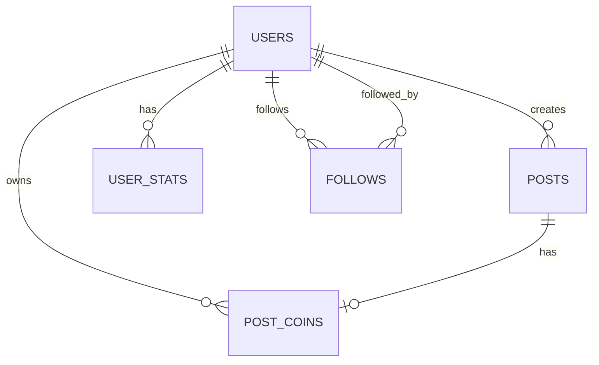

# YourZ Technical Documentation

## Table of Contents

1. [Architecture Overview](#architecture-overview)
2. [Technology Stack](#technology-stack)
3. [Blockchain Integration](#blockchain-integration)
4. [Database Schema](#database-schema)
5. [API Architecture](#api-architecture)
6. [Frontend Architecture](#frontend-architecture)
7. [State Management](#state-management)
8. [Security Considerations](#security-considerations)
9. [Performance Optimization](#performance-optimization)
10. [Development Setup](#development-setup)
11. [Deployment](#deployment)
12. [Testing Strategy](#testing-strategy)
13. [Monitoring & Analytics](#monitoring--analytics)

## Architecture Overview

YourZ is built as a modern Web3 application with a microservices-inspired architecture that separates concerns between blockchain operations, data persistence, and user interface.

### System Architecture

```
┌─────────────────┐    ┌─────────────────┐    ┌─────────────────┐
│   Frontend      │    │   Backend       │    │   Blockchain    │
│   (Next.js)     │◄──►│   (Supabase)    │◄──►│   (Zora/BASE)   │
└─────────────────┘    └─────────────────┘    └─────────────────┘
         │                       │                       │
         │                       │                       │
         ▼                       ▼                       ▼
┌─────────────────┐    ┌─────────────────┐    ┌─────────────────┐
│   IPFS Storage   │    │   File Storage  │    │   Smart         │
│   (Content)      │    │   (Images)      │    │   Contracts     │
└─────────────────┘    └─────────────────┘    └─────────────────┘
```

### Key Architectural Principles

1. **Decentralized Content Storage**: All content is stored on IPFS for permanence and censorship resistance
2. **Hybrid Database**: Supabase for relational data, blockchain for ownership and transactions
3. **Client-Side Wallet Integration**: Direct blockchain interaction through user wallets
4. **Stateless API Design**: RESTful APIs with JWT authentication
5. **Progressive Enhancement**: Core functionality works without JavaScript

## Technology Stack

### Frontend
- **Framework**: Next.js 14 with App Router
- **Language**: TypeScript 5.3+
- **Styling**: Tailwind CSS 3.4+ with custom design system
- **State Management**: React Query (TanStack Query) for server state
- **UI Components**: Headless UI + custom components
- **Animations**: Framer Motion
- **Icons**: Lucide React + React Icons

### Web3 & Blockchain
- **Wallet Integration**: Wagmi + RainbowKit
- **Blockchain Client**: Viem 2.x
- **NFT Protocol**: Zora Protocol SDK
- **Token Standard**: ERC-20 (Zora Coins) + ERC-1155 (NFTs)
- **Network**: Base Sepolia (testnet) + Base Mainnet
- **Chain ID**: 84532 (Base Sepolia), 8453 (Base Mainnet)

### Backend & Storage
- **Database**: Supabase (PostgreSQL)
- **Authentication**: Supabase Auth + Wallet-based auth
- **File Storage**: IPFS via NFT.Storage
- **Real-time**: Supabase Realtime subscriptions
- **Edge Functions**: Supabase Edge Functions

### Development Tools
- **Package Manager**: npm
- **Linting**: ESLint + Next.js config
- **Formatting**: Prettier
- **Type Checking**: TypeScript strict mode
- **Build Tool**: Next.js built-in bundler

## Blockchain Integration

### Zora Protocol Integration

YourZ leverages Zora Protocol for both NFT and token creation:

#### ERC-20 Token Creation (Post Coins)
```typescript
// Example: Creating a post coin
const deployZoraCoin = async ({
  name,
  symbol,
  uri,
  payoutRecipient,
  mintFeeRecipient,
  walletClient,
  publicClient,
  account,
}: {
  name: string;
  symbol: string;
  uri: string;
  payoutRecipient: `0x${string}`;
  mintFeeRecipient: `0x${string}`;
  walletClient: WalletClient;
  publicClient: PublicClient;
  account: `0x${string}`;
}): Promise<`0x${string}`> => {
  // Implementation details...
}
```

#### ERC-1155 NFT Creation
```typescript
// Example: Creating an NFT collection
const create1155Contract = async ({
  name,
  description,
  symbol,
  royaltyBps,
  royaltyRecipient,
}: Create1155ContractParams): Promise<`0x${string}`> => {
  // Implementation details...
}
```

### Smart Contract Architecture

#### Post Coin Contract (ERC-20)
- **Standard**: ERC-20 with Zora Coins SDK
- **Features**: 
  - Configurable mint fees
  - Royalty distribution
  - Liquidity pool integration
  - Governance capabilities

#### NFT Contract (ERC-1155)
- **Standard**: ERC-1155 with Zora Protocol
- **Features**:
  - Batch minting
  - Configurable royalties
  - Metadata URI support
  - Access control

### Transaction Flow

1. **Content Creation**: User creates post → IPFS upload → Database record
2. **Token Creation**: Deploy ERC-20 contract → Mint initial supply → Database record
3. **Trading**: Buy/sell tokens → Update balances → Emit events
4. **Royalties**: Automatic distribution on secondary sales

## Database Schema

### Core Tables

#### Users Table
```sql
CREATE TABLE users (
  id UUID PRIMARY KEY DEFAULT gen_random_uuid(),
  address TEXT UNIQUE NOT NULL,
  username TEXT UNIQUE,
  email TEXT,
  bio TEXT,
  ipfs_hash TEXT,
  social_links JSONB DEFAULT '{}',
  level INTEGER DEFAULT 1,
  created_at TIMESTAMPTZ DEFAULT NOW(),
  updated_at TIMESTAMPTZ DEFAULT NOW()
);
```

#### Posts Table
```sql
CREATE TABLE posts (
  id UUID PRIMARY KEY DEFAULT gen_random_uuid(),
  title TEXT NOT NULL,
  content TEXT NOT NULL,
  address TEXT REFERENCES users(address),
  ipfs_hash TEXT,
  metadata JSONB DEFAULT '{}',
  status TEXT DEFAULT 'draft',
  is_nft BOOLEAN DEFAULT FALSE,
  nft_contract_address TEXT,
  nft_token_id TEXT,
  created_at TIMESTAMPTZ DEFAULT NOW(),
  updated_at TIMESTAMPTZ DEFAULT NOW()
);
```

#### Post Coins Table
```sql
CREATE TABLE post_coins (
  id UUID PRIMARY KEY DEFAULT gen_random_uuid(),
  post_id UUID REFERENCES posts(id) ON DELETE CASCADE,
  contract_address TEXT NOT NULL,
  name TEXT NOT NULL,
  symbol TEXT NOT NULL,
  total_supply NUMERIC NOT NULL,
  creator_id UUID REFERENCES users(id),
  created_at TIMESTAMPTZ DEFAULT NOW(),
  updated_at TIMESTAMPTZ DEFAULT NOW()
);
```

#### User Stats Table
```sql
CREATE TABLE user_stats (
  id UUID PRIMARY KEY DEFAULT gen_random_uuid(),
  address TEXT REFERENCES users(address),
  posts_count INTEGER DEFAULT 0,
  followers_count INTEGER DEFAULT 0,
  following_count INTEGER DEFAULT 0,
  collections_count INTEGER DEFAULT 0,
  nfts_count INTEGER DEFAULT 0,
  total_likes INTEGER DEFAULT 0,
  created_at TIMESTAMPTZ DEFAULT NOW(),
  updated_at TIMESTAMPTZ DEFAULT NOW()
);
```

### Relationships



## API Architecture

### RESTful Endpoints

#### Authentication
```typescript
// POST /api/auth/wallet
interface WalletAuthRequest {
  address: string;
  signature: string;
  message: string;
}

// POST /api/auth/refresh
interface RefreshTokenRequest {
  refreshToken: string;
}
```

#### Posts
```typescript
// GET /api/posts
interface GetPostsQuery {
  page?: number;
  limit?: number;
  category?: string;
  author?: string;
}

// POST /api/posts
interface CreatePostRequest {
  title: string;
  content: string;
  metadata?: {
    tags?: string[];
    image?: string;
  };
}

// GET /api/posts/[id]
interface GetPostResponse {
  id: string;
  title: string;
  content: string;
  author: User;
  metadata: PostMetadata;
  coin?: PostCoin;
  nft?: NFT;
}
```

#### Coins
```typescript
// POST /api/coins
interface CreateCoinRequest {
  postId: string;
  name: string;
  symbol: string;
  totalSupply: number;
}

// GET /api/coins/[id]
interface GetCoinResponse {
  id: string;
  contractAddress: string;
  name: string;
  symbol: string;
  totalSupply: number;
  currentPrice: number;
  marketCap: number;
}
```

### GraphQL Schema (Future)

```graphql
type Post {
  id: ID!
  title: String!
  content: String!
  author: User!
  coin: PostCoin
  nft: NFT
  metadata: PostMetadata
  createdAt: DateTime!
  updatedAt: DateTime!
}

type PostCoin {
  id: ID!
  contractAddress: String!
  name: String!
  symbol: String!
  totalSupply: BigInt!
  currentPrice: Float
  marketCap: Float
  creator: User!
  post: Post!
}

type User {
  id: ID!
  address: String!
  username: String
  bio: String
  stats: UserStats!
  posts: [Post!]!
  coins: [PostCoin!]!
}
```

## Frontend Architecture

### Component Structure

```
src/
├── app/                    # Next.js App Router
│   ├── (main)/            # Main layout routes
│   ├── api/               # API routes
│   ├── coins/             # Coin marketplace
│   ├── dashboard/         # User dashboard
│   ├── explore/           # Content discovery
│   ├── marketplace/       # NFT marketplace
│   ├── post/              # Individual post pages
│   ├── profile/           # User profiles
│   ├── trade/             # Trading interface
│   └── write/             # Content creation
├── components/            # React components
│   ├── marketplace/       # Marketplace-specific components
│   ├── post/              # Post-related components
│   ├── providers/         # Context providers
│   └── ui/                # Reusable UI components
├── hooks/                 # Custom React hooks
├── lib/                   # Utility libraries
├── services/              # API and external services
├── types/                 # TypeScript type definitions
└── utils/                 # Helper functions
```

### Key Components

#### PostEditor
```typescript
interface PostEditorProps {
  initialContent?: string;
  onSave: (content: string) => void;
  onPublish?: (post: PostData) => void;
  isEditing?: boolean;
}

// Features:
// - Rich text editing with React Quill
// - Image upload to IPFS
// - Auto-save functionality
// - Markdown support
// - Tag management
```

#### CoinModal
```typescript
interface CoinModalProps {
  post: Post;
  isOpen: boolean;
  onClose: () => void;
  onSuccess: (coin: PostCoin) => void;
}

// Features:
// - Token creation wizard
// - Price and supply configuration
// - Contract deployment
// - Transaction status tracking
```

#### TradingInterface
```typescript
interface TradingInterfaceProps {
  coin: PostCoin;
  userBalance?: number;
  onTrade: (action: 'buy' | 'sell', amount: number) => void;
}

// Features:
// - Real-time price updates
// - Order book visualization
// - Trade history
// - Portfolio tracking
```

### State Management

#### React Query Integration
```typescript
// Query keys for caching
export const queryKeys = {
  posts: ['posts'] as const,
  post: (id: string) => ['post', id] as const,
  userPosts: (address: string) => ['user-posts', address] as const,
  coins: ['coins'] as const,
  coin: (id: string) => ['coin', id] as const,
  userCoins: (address: string) => ['user-coins', address] as const,
  userProfile: (address: string) => ['user-profile', address] as const,
} as const;

// Custom hooks for data fetching
export const usePosts = (params?: GetPostsQuery) => {
  return useQuery({
    queryKey: queryKeys.posts,
    queryFn: () => postsService.getPosts(params),
    staleTime: 5 * 60 * 1000, // 5 minutes
  });
};
```

#### Context Providers
```typescript
// Wallet context for blockchain interactions
export const WalletProvider = ({ children }: { children: React.ReactNode }) => {
  return (
    <WagmiConfig config={wagmiConfig}>
      <RainbowKitProvider chains={chains} locale={enUS()}>
        {children}
      </RainbowKitProvider>
    </WagmiConfig>
  );
};

// Theme context for dark/light mode
export const ThemeProvider = ({ children }: { children: React.ReactNode }) => {
  return (
    <NextThemesProvider attribute="class" defaultTheme="system" enableSystem>
      {children}
    </NextThemesProvider>
  );
};
```

## Security Considerations

### Authentication & Authorization

#### Wallet-Based Authentication
```typescript
// Verify wallet signature
const verifySignature = async (
  address: string,
  signature: string,
  message: string
): Promise<boolean> => {
  const recoveredAddress = recoverAddress({
    hash: hashMessage(message),
    signature: signature as `0x${string}`,
  });
  return recoveredAddress.toLowerCase() === address.toLowerCase();
};
```

#### Row Level Security (RLS)
```sql
-- Example: Users can only update their own posts
CREATE POLICY "Users can update own posts" ON posts
  FOR UPDATE USING (auth.uid()::text = address);

-- Example: Users can only delete their own posts
CREATE POLICY "Users can delete own posts" ON posts
  FOR DELETE USING (auth.uid()::text = address);
```

### Smart Contract Security

#### Access Control
```solidity
// Example: Only owner can mint
modifier onlyOwner() {
    require(msg.sender == owner, "Not authorized");
    _;
}

// Example: Pausable functionality
modifier whenNotPaused() {
    require(!paused, "Contract is paused");
    _;
}
```

#### Reentrancy Protection
```solidity
// Example: Reentrancy guard
modifier nonReentrant() {
    require(!locked, "Reentrant call");
    locked = true;
    _;
    locked = false;
}
```

### Data Validation

#### Input Sanitization
```typescript
// Sanitize user input
const sanitizeInput = (input: string): string => {
  return DOMPurify.sanitize(input, {
    ALLOWED_TAGS: ['p', 'br', 'strong', 'em', 'u', 'h1', 'h2', 'h3'],
    ALLOWED_ATTR: [],
  });
};

// Validate Ethereum address
const isValidAddress = (address: string): boolean => {
  return /^0x[a-fA-F0-9]{40}$/.test(address);
};
```

## Performance Optimization

### Frontend Optimization

#### Code Splitting
```typescript
// Dynamic imports for heavy components
const CoinModal = dynamic(() => import('@/components/CoinModal'), {
  loading: () => <CoinModalSkeleton />,
  ssr: false,
});

const TradingInterface = dynamic(() => import('@/components/TradingInterface'), {
  loading: () => <TradingSkeleton />,
  ssr: false,
});
```

#### Image Optimization
```typescript
// Next.js Image component with optimization
import Image from 'next/image';

<Image
  src={post.metadata.image}
  alt={post.title}
  width={400}
  height={300}
  placeholder="blur"
  blurDataURL="data:image/jpeg;base64,..."
  priority={isAboveFold}
/>
```

#### Caching Strategy
```typescript
// React Query caching configuration
const queryClient = new QueryClient({
  defaultOptions: {
    queries: {
      staleTime: 5 * 60 * 1000, // 5 minutes
      cacheTime: 10 * 60 * 1000, // 10 minutes
      retry: 3,
      refetchOnWindowFocus: false,
    },
  },
});
```

### Backend Optimization

#### Database Indexing
```sql
-- Index for fast post queries
CREATE INDEX idx_posts_created_at ON posts(created_at DESC);
CREATE INDEX idx_posts_address ON posts(address);
CREATE INDEX idx_posts_status ON posts(status);

-- Index for coin queries
CREATE INDEX idx_post_coins_contract ON post_coins(contract_address);
CREATE INDEX idx_post_coins_creator ON post_coins(creator_id);

-- Composite indexes for complex queries
CREATE INDEX idx_posts_category_created ON posts(category, created_at DESC);
```

#### Connection Pooling
```typescript
// Supabase connection pooling
const supabase = createClient(
  process.env.NEXT_PUBLIC_SUPABASE_URL!,
  process.env.NEXT_PUBLIC_SUPABASE_ANON_KEY!,
  {
    db: {
      schema: 'public',
    },
    auth: {
      persistSession: true,
      autoRefreshToken: true,
    },
  }
);
```

## Development Setup

### Prerequisites
- Node.js 18+
- npm or yarn
- Git
- Ethereum wallet (MetaMask, Rainbow, etc.)
- Supabase account
- IPFS/NFT.Storage account

### Environment Variables
```env
# Wallet Connect
NEXT_PUBLIC_WALLET_CONNECT_PROJECT_ID=your_wallet_connect_project_id

# Blockchain APIs
NEXT_PUBLIC_INFURA_API_KEY=your_infura_api_key
NEXT_PUBLIC_ALCHEMY_API_KEY=your_alchemy_api_key

# Zora Protocol
NEXT_PUBLIC_ZORA_API_KEY=your_zora_api_key

# Supabase
NEXT_PUBLIC_SUPABASE_URL=your_supabase_url
NEXT_PUBLIC_SUPABASE_ANON_KEY=your_supabase_anon_key
SUPABASE_SERVICE_ROLE_KEY=your_supabase_service_role_key

# IPFS
NEXT_PUBLIC_NFT_STORAGE_API_KEY=your_nft_storage_api_key

# Optional: Analytics
NEXT_PUBLIC_GOOGLE_ANALYTICS_ID=your_ga_id
NEXT_PUBLIC_MIXPANEL_TOKEN=your_mixpanel_token
```

### Installation Steps
```bash
# 1. Clone repository
git clone https://github.com/yourusername/yourz.git
cd yourz

# 2. Install dependencies
npm install

# 3. Set up environment variables
cp .env.example .env.local
# Edit .env.local with your values

# 4. Set up database
npx supabase db push

# 5. Start development server
npm run dev
```

### Development Scripts
```json
{
  "scripts": {
    "dev": "next dev",
    "build": "next build",
    "start": "next start",
    "lint": "next lint",
    "type-check": "tsc --noEmit",
    "test": "jest",
    "test:watch": "jest --watch",
    "test:coverage": "jest --coverage"
  }
}
```

## Deployment

### Vercel Deployment
```bash
# 1. Connect to Vercel
vercel --prod

# 2. Set environment variables in Vercel dashboard
# 3. Deploy automatically on push to main branch
```

### Docker Deployment
```dockerfile
# Dockerfile
FROM node:18-alpine AS base

# Install dependencies
FROM base AS deps
WORKDIR /app
COPY package*.json ./
RUN npm ci --only=production

# Build application
FROM base AS builder
WORKDIR /app
COPY . .
COPY --from=deps /app/node_modules ./node_modules
RUN npm run build

# Production image
FROM base AS runner
WORKDIR /app
ENV NODE_ENV production

COPY --from=builder /app/public ./public
COPY --from=builder /app/.next/standalone ./
COPY --from=builder /app/.next/static ./.next/static

EXPOSE 3000
ENV PORT 3000
ENV HOSTNAME "0.0.0.0"

CMD ["node", "server.js"]
```

### Environment-Specific Configurations

#### Development
```typescript
// config/development.ts
export const config = {
  blockchain: {
    chainId: 84532, // Base Sepolia
    rpcUrl: 'https://sepolia.base.org',
    explorerUrl: 'https://sepolia.basescan.org',
  },
  ipfs: {
    gateway: 'https://ipfs.io/ipfs/',
    apiUrl: 'https://api.nft.storage',
  },
};
```

#### Production
```typescript
// config/production.ts
export const config = {
  blockchain: {
    chainId: 8453, // Base Mainnet
    rpcUrl: 'https://mainnet.base.org',
    explorerUrl: 'https://basescan.org',
  },
  ipfs: {
    gateway: 'https://ipfs.io/ipfs/',
    apiUrl: 'https://api.nft.storage',
  },
};
```

## Testing Strategy

### Unit Testing
```typescript
// Example: Testing post creation
describe('PostService', () => {
  it('should create a new post', async () => {
    const postData = {
      title: 'Test Post',
      content: 'Test content',
      address: '0x123...',
    };

    const result = await postService.createPost(postData);
    
    expect(result).toHaveProperty('id');
    expect(result.title).toBe(postData.title);
    expect(result.content).toBe(postData.content);
  });
});
```

### Integration Testing
```typescript
// Example: Testing coin creation flow
describe('Coin Creation Flow', () => {
  it('should create coin for post', async () => {
    // 1. Create post
    const post = await postService.createPost(postData);
    
    // 2. Create coin
    const coin = await coinService.createCoin({
      postId: post.id,
      name: 'Test Coin',
      symbol: 'TEST',
      totalSupply: 1000000,
    });
    
    // 3. Verify blockchain transaction
    const contract = await getContract(coin.contractAddress);
    expect(await contract.name()).toBe('Test Coin');
    expect(await contract.symbol()).toBe('TEST');
  });
});
```

### E2E Testing
```typescript
// Example: Testing complete user journey
describe('User Journey', () => {
  it('should allow user to create post and coin', async () => {
    // 1. Connect wallet
    await page.click('[data-testid="connect-wallet"]');
    
    // 2. Create post
    await page.fill('[data-testid="post-title"]', 'Test Post');
    await page.fill('[data-testid="post-content"]', 'Test content');
    await page.click('[data-testid="publish-post"]');
    
    // 3. Create coin
    await page.click('[data-testid="create-coin"]');
    await page.fill('[data-testid="coin-name"]', 'Test Coin');
    await page.fill('[data-testid="coin-symbol"]', 'TEST');
    await page.click('[data-testid="deploy-coin"]');
    
    // 4. Verify success
    await expect(page.locator('[data-testid="success-message"]')).toBeVisible();
  });
});
```

## Monitoring & Analytics

### Error Tracking
```typescript
// Sentry integration
import * as Sentry from '@sentry/nextjs';

Sentry.init({
  dsn: process.env.NEXT_PUBLIC_SENTRY_DSN,
  environment: process.env.NODE_ENV,
  tracesSampleRate: 1.0,
});

// Error boundary component
export const ErrorBoundary = ({ children }: { children: React.ReactNode }) => {
  return (
    <Sentry.ErrorBoundary fallback={<ErrorFallback />}>
      {children}
    </Sentry.ErrorBoundary>
  );
};
```

### Performance Monitoring
```typescript
// Web Vitals tracking
import { getCLS, getFID, getFCP, getLCP, getTTFB } from 'web-vitals';

function sendToAnalytics(metric: any) {
  // Send to your analytics service
  console.log(metric);
}

getCLS(sendToAnalytics);
getFID(sendToAnalytics);
getFCP(sendToAnalytics);
getLCP(sendToAnalytics);
getTTFB(sendToAnalytics);
```

### Blockchain Event Monitoring
```typescript
// Monitor smart contract events
const monitorContractEvents = async (contractAddress: string) => {
  const contract = getContract(contractAddress);
  
  contract.on('Transfer', (from, to, amount) => {
    console.log(`Transfer: ${from} -> ${to}: ${amount}`);
    // Update database, send notifications, etc.
  });
  
  contract.on('Mint', (to, amount) => {
    console.log(`Mint: ${to}: ${amount}`);
    // Update user balances, trigger UI updates
  });
};
```

### Database Monitoring
```sql
-- Monitor slow queries
SELECT 
  query,
  mean_time,
  calls,
  total_time
FROM pg_stat_statements 
ORDER BY mean_time DESC 
LIMIT 10;

-- Monitor table sizes
SELECT 
  schemaname,
  tablename,
  pg_size_pretty(pg_total_relation_size(schemaname||'.'||tablename)) as size
FROM pg_tables 
WHERE schemaname = 'public'
ORDER BY pg_total_relation_size(schemaname||'.'||tablename) DESC;
```

---

## Contributing

For detailed contribution guidelines, please see [CONTRIBUTING.md](./CONTRIBUTING.md).

## License

This project is licensed under the MIT License - see the [LICENSE](./LICENSE) file for details.

---

*This technical documentation is maintained by the YourZ development team. For questions or clarifications, please open an issue on GitHub.* 